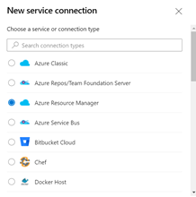
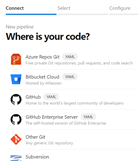
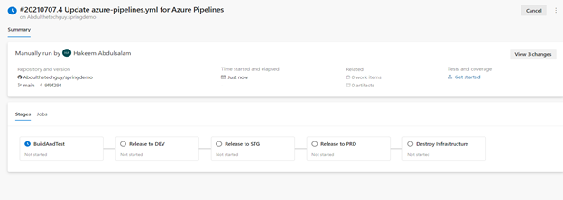

# Spring and React Application CI-CD on Azure Devops
This is a simple application with a react frontend, spring boot backend and MySQL database

## DevOps workflow and Architecture

# Infrastructure Breakdown
 **Infrastructure:**
Here is an architecture built on Microsoft Azure taking advantage of its AppService Offering.

App Service provides the managed virtual machines (VMs) that host your app. All apps associated with a plan run on the same VM instances.

I chose AppService because it has Linux Container webapp offering that can host docker containers and its cost effective.

There is also a mysql deployed for the database
# Infrastructure Component
## Monitoring and Auditing
The AppService is integrated with Azure Application Insight for monitoring. It collects different metrics such us request rate, response time, failure rate etc. It could also detect anomalies within the application. Auditing is done using the Activity Log.

## AutoScaling
I am using Standard AppService Tier which could scale up to 10 instances. Its has been configured to scale based on CPU metric. When the CPU consumption hit 70% it scales up automatically and scale down when it goes below 30%

## Authentication
Leveraging Azure Active Directory for authentication and authorization. With this, multiple users can be invited to login with their personal accounts and permission to resources can be granted.

# How to deploy the application on your environment

 Running the pipeline will do the following:
1. Check out the code

2. Build an ACR if it doesn’t exist

3. Create a mysql database for the backend

4. Build the and test the code base

5. Build the docker image and push to azure registry

6. Publish Artifact (ARM template) to build the infrastructure (Linux container appservice) for the 3 stages

7. Deploy docker image to DEV, STG and PRD stage

8. There is a destroy stage (Using pipeline approval). Click on it to review and approve to destroy the whole infrastructure built
 # Prerequisite:
**Azure DevOps account:** we will use an Azure DevOps project with a Github repo and build/release pipelines. Create your free account and a new project [here](https://azure.microsoft.com/services/devops/).

**Azure Subscription:** An azure subscription is needed to provision the Azure services for this demonstration. If you don’t have one, you can get a free trial one [here](https://azure.microsoft.com/free/). Create an azure DevOps project

**Bash Shell:** we will leverage Azure Cloud Shell. Once your Azure Subscription is set up you can enable and use your associated [Azure Cloud Shell](https://docs.microsoft.com/azure/cloud-shell/overview) session. Notes: you could use any local bash terminal. Make sure you have [installed the Azure CLI](https://docs.microsoft.com/cli/azure/install-azure-cli)

**Container registry:** we will use Azure Container Registry (ACR) to store our Docker images. Run the command below to create an ACR

**Service Principal:** we will leverage SPN with contributor access to create resources on Azure from Azure DevOps

  

# Create a resource group in Azure

    #Login to Azure
    az login
    #Set subscription
    az account set --subscription <subscription  id>
    #Create Resource Group
    #az group create --name <rgname> --location <region>
    az group create --name spring-demo --location 'West US'

  
**Create an ACR registry**

   #az acr create --resource-group akshandsonlab --name <unique-acr-name> --sku Standard --location <region> --admin-enabled true
 az acr create --resource-group spring-demo --name springacr2021 --sku Standard --location 'West US' --admin-enabled true

**To create a Service Principal Name**

       #az ad sp create-for-rbac --name <service-principal-name>
       az ad sp create-for-rbac --name SpringSpn

  
  

## Create a Build / Continuous Integration (CI) pipeline and continuous delivery (CD)

Create a service connection for ACR and for the pipeline using the details of the service principal created earlier

  

**Fill the following details:**

**Subscription ID:** < Your  Subscription  ID>
**Subscription Name:** < subscription  name>
**Service principal id:**  < Service  principal  Id>
**Service principal Key:** < Service  Principal  Key>
**Tenant ID :** < Your  Tenant  ID>
**Service Connection Name:**  <Service  connection  Name> This will be referenced in the YAML pipeline
**Click on save and verify**

Repeat the same step to create a service connection for ACR:
Click on service Connection
Click on Docker Registry 
Select Azure Container Registry.
Select your prefered subscription 
Give a connection name. This will later be referenced in the YAML pipeline to connect to the registry

## Create a multi Stage pipeline with Yaml

First fork the [repo](https://github.com/Abdulthetechguy/Springdemo) by clicking on the fork icon on the top right

Navigate to your DevOps project and Create a pipeline by clicking on the Pipeline icon

  Click on **New Pipeline** and select **GitHub (YAML)**

  

Login to Github and authorize it for Azure DevOps. Select the forked repo and it will automatically pick the azure-pipeline.yml file in the repo which contains the YAML template for the build and release stage. Click on **Save and Run** to run the pipeline

  

**See a complete build below:**

  

 #Building the Project with Jenkins and Terraform on AWS

  

Here is the link to [repo](https://github.com/Abdulthetechguy/Spring-React-CI-CD-Jenkis-AWS) that contains the project and instruction on how to build on AWS using packer,Jenkins, terraform and Ansible. Still a work in progress

